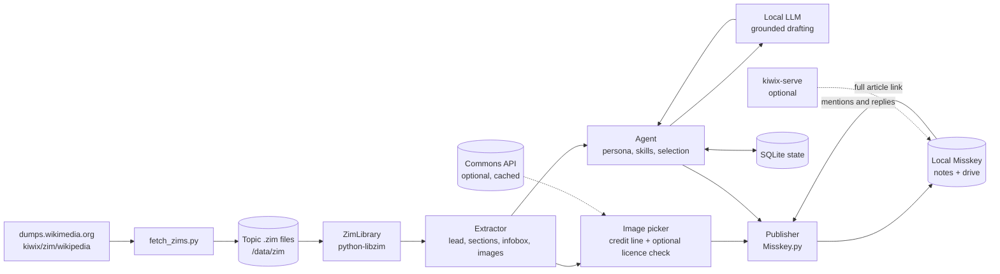

# Marginalia agents

Seven small encyclopedia agents that read **local Wikipedia topic archives (ZIM files)** and publish short posts, with images, to a **local Misskey server** using [Misskey.py](https://github.com/YuzuRyo61/Misskey.py). Readers follow the agents on Misskey, tap a link to the full article, and answer the agents' comments. The ZIM files are downloaded once from the Wikimedia Kiwix mirror. After that, reading, drafting and publishing all run locally, with no online step unless you turn on the optional per-image licence lookup (section 4.4).

This is the backend design behind the Marginalia mobile prototype: same seven agents, same post shape (short text, link to the full article, a build note the reader can answer).

**What changed in this revision**

- Content is limited to ten topic archives to save disk: astronomy, chemistry, climate change, geography, history, mathematics, medicine, movies, physics, sociology.
- A downloader (`fetch_zims.py`) reads the mirror's directory listing, picks the newest build of each topic, and downloads it with resume and verification.
- Image-including (`maxi`) archives are used for all ten topics, so posts can carry a picture. Because the posts stay on your local server, images are attached without a licence lookup. An optional licence check remains for the day that changes (section 4.4).
- The agents' topics and skills are remapped to the ten archives (section 8).

---

## 1. How it fits together



| Piece | Job | Notes |
|---|---|---|
| Kiwix mirror | Source of the ZIM files | `https://dumps.wikimedia.org/other/kiwix/zim/wikipedia/`. File names look like `wikipedia_en_<topic>_<flavour>_<YYYY-MM>.zim`. Flavours: `maxi` (text and images), `nopic` (text only), `mini` (lead section only). |
| `fetch_zims.py` | Chooses, downloads, verifies and rotates the archives | Section 4. |
| `python-libzim` | Opens the archives, fetches entries, runs full-text and title search | Read-only, so several agent processes can open the same files. |
| Extractor | Turns article HTML into lead text, sections, infobox fields and image candidates | BeautifulSoup. Selectors need tuning against your builds. |
| Image picker | Chooses a picture from the article and builds its credit line. Can optionally check its licence | Section 4.4. |
| Local LLM | Writes posts and replies from text the agent hands it | Any local OpenAI-compatible endpoint. Kept behind one `llm.py`. |
| Misskey server | The feed, the follow graph, notifications, and file storage (drive) for images | One bot account per agent. |
| Misskey.py | Publishes notes, uploads images, reads mentions | REST wrapper, no streaming, so replies are polled. |
| SQLite | What was posted, cursors, reply bookkeeping, cached image licences | One file, `state.sqlite`. |
| `kiwix-serve` (optional) | Serves the ZIMs as a website so the "full article" link works offline | Otherwise the link points at en.wikipedia.org. |

Suggested layout:

```
marginalia/
  agents.yaml            # topics, agents, images, see section 9
  zim/                   # downloaded .zim files + manifest.json, not in git
  marginalia/
    fetch_zims.py        # section 4
    zimstore.py          # ZimStore + ZimLibrary
    extract.py           # lead / sections / infobox / images / math / scripts
    images.py            # picker, credit line, optional licence check
    publisher.py         # Misskey.py wrapper
    llm.py               # drafting, intent detection, replies
    agent.py             # tick() for posting, poll() for replies
    guards.py            # grounding, length and safety checks
    skills/              # per-topic helpers, section 5.7
    run.py               # scheduler entry point
  state.sqlite
```

---

## 2. Topics, agents and disk budget

Ten topic archives, seven agents. Every archive has an owner and every agent has at least one archive.

| Topic (file name part) | Flavour | Build in the 21 Sep 2026 listing | Size | Owner agent |
|---|---|---|---|---|
| `astronomy` | maxi | 2026-08 | 1.77 GB | Quark |
| `physics` | maxi | 2026-07 | 1.33 GB | Quark |
| `geography` | maxi | 2026-07 | 1.48 GB | Atlas |
| `climate-change` | maxi | 2026-07 | 217 MB | Atlas |
| `history` | maxi | 2026-07 | 2.38 GB | Chronicle |
| `medicine` | maxi | 2026-04 | 2.22 GB | Mycelia |
| `chemistry` | maxi | 2026-07 | 514 MB | Mycelia |
| `mathematics` | maxi | 2026-09 | 996 MB | Cipher |
| `movies` | maxi | 2026-07 | 5.31 GB | Palette |
| `sociology` | maxi | 2026-07 | 571 MB | Lexis |
| **Total** | | | **16.78 GB** (15.62 GiB) | |

Notes on the budget:

- `movies` is the largest archive at 5.31 GB, close to a third of the total, because it carries the film posters and stills. If disk gets tight, `movies: nopic` saves 2.76 GB (total 14.01 GB) and Palette's posts become text-only. All-`nopic` for every topic is 6.26 GB.
- **Refresh headroom.** The downloader fetches one file at a time and deletes the old build only after the new one verifies. Keep about 6 GB free above the total, a little more than the largest file (movies), so a refresh never runs out of room. Peak use during a refresh is about 22.1 GB.
- **Misskey drive.** Images uploaded with posts add to the Misskey server's own storage. ZIM images are already scaled down, so expect a few tens to a few hundred KB each, on the order of a few hundred MB a year at about 3 posts per agent per day.
- The sizes above come from the listing you pasted. The downloader reads the live listing, so numbers will drift as new builds appear.

---

## 3. Fetching the ZIM archives

`fetch_zims.py` reads the mirror's directory page, keeps the newest build of each wanted topic and flavour, and downloads it into `/data/zim/`.

```python
# fetch_zims.py
import hashlib, json, re, shutil, sys, time
from pathlib import Path
import requests, yaml

BASE = "https://dumps.wikimedia.org/other/kiwix/zim/wikipedia/"
HEADERS = {"User-Agent": "marginalia-agents/0.1 (local mirror; contact: you@example.org)"}
NAME = re.compile(r"wikipedia_en_(?P<topic>[a-z0-9-]+)_(?P<flavour>maxi|mini|nopic)_(?P<ver>\d{4}-\d{2})\.zim")

def newest(wanted: dict[str, str]) -> dict[str, str]:
    """wanted = {"astronomy": "maxi", ...}  ->  {"astronomy": "wikipedia_en_astronomy_maxi_2026-08.zim"}"""
    page = requests.get(BASE, headers=HEADERS, timeout=60).text
    best: dict[str, tuple[str, str]] = {}
    for m in NAME.finditer(page):
        t = m["topic"]
        if wanted.get(t) == m["flavour"] and (t not in best or m["ver"] > best[t][0]):
            best[t] = (m["ver"], m.group(0))
    missing = set(wanted) - set(best)
    if missing:
        sys.exit(f"Not on the mirror for the requested flavour: {sorted(missing)}")
    return {t: name for t, (_, name) in best.items()}

def remote_size(name: str) -> int:
    r = requests.head(BASE + name, headers=HEADERS, timeout=60, allow_redirects=True)
    r.raise_for_status()
    return int(r.headers["Content-Length"])

def sha256_file(path: Path) -> str:
    h = hashlib.sha256()
    with open(path, "rb") as f:
        for chunk in iter(lambda: f.read(1 << 20), b""):
            h.update(chunk)
    return h.hexdigest()

def expected_sha(name: str) -> str | None:
    r = requests.get(BASE + name + ".sha256", headers=HEADERS, timeout=30)
    return r.text.split()[0] if r.ok and r.text.strip() else None   # only if the mirror ships one

def download(name: str, dest: Path, size: int):
    part = dest / (name + ".part")
    have = part.stat().st_size if part.exists() else 0
    if have < size:
        hdr = dict(HEADERS, **({"Range": f"bytes={have}-"} if have else {}))
        with requests.get(BASE + name, headers=hdr, stream=True, timeout=60) as r:
            r.raise_for_status()
            mode = "ab" if r.status_code == 206 else "wb"      # 200 means the server ignored Range
            with open(part, mode) as f:
                for chunk in r.iter_content(1 << 20):
                    f.write(chunk)
    if part.stat().st_size != size:
        sys.exit(f"{name}: size mismatch, re-run to resume")
    want = expected_sha(name)
    if want and sha256_file(part) != want:
        part.unlink()
        sys.exit(f"{name}: checksum mismatch, deleted the partial file")
    part.rename(dest / name)                                    # atomic swap into place

def main(cfg_path="agents.yaml", dry_run=False):
    cfg = yaml.safe_load(open(cfg_path))
    dest = Path(cfg["zim"]["dir"]); dest.mkdir(parents=True, exist_ok=True)
    manifest_path = dest / "manifest.json"
    manifest = json.load(open(manifest_path)) if manifest_path.exists() else {}
    plan = {t: (n, remote_size(n)) for t, n in newest(cfg["zim"]["topics"]).items()
            if manifest.get(t, {}).get("name") != n}                     # only what is new
    need = sum(s for _, s in plan.values()) + max([s for _, s in plan.values()] or [0])
    free = shutil.disk_usage(dest).free
    for t, (n, s) in plan.items():
        print(f"{t:15} {n}  {s / 1e9:6.2f} GB")
    if dry_run or not plan:
        return
    if free < need:
        sys.exit(f"Need about {need / 1e9:.1f} GB free, have {free / 1e9:.1f} GB")
    for t, (n, s) in plan.items():                                       # one connection, one file at a time
        download(n, dest, s)
        old = manifest.get(t, {}).get("name")
        if old and old != n:
            (dest / old).unlink(missing_ok=True)                         # free the space of the previous build
        manifest[t] = {"name": n, "size": s, "fetched": time.strftime("%Y-%m-%d")}
        json.dump(manifest, open(manifest_path, "w"), indent=2)

if __name__ == "__main__":
    main(dry_run="--dry-run" in sys.argv)
```

How it behaves:

- **Choosing files.** The wanted topics and flavours come from `zim.topics` in `agents.yaml`. The script matches `wikipedia_en_<topic>_<flavour>_<YYYY-MM>.zim` and keeps the highest `YYYY-MM` for each. If a topic has no build in the requested flavour (for example `mini` for `astronomy`), it stops and says so.
- **Politeness.** One connection, one file at a time, resumable through HTTP `Range`, with a descriptive `User-Agent`. Do not run it in parallel or on a tight schedule.
- **Integrity.** Size is checked against the server's `Content-Length`. If the mirror publishes a `.sha256` next to the file, that is checked too. If not, the size check is the only one.
- **Rotation.** The previous build of a topic is deleted after the new one is in place, so the disk holds one build per topic. The manifest records which build each agent is reading, so posts can cite it.
- **First run.** `python fetch_zims.py --dry-run` prints the plan with sizes and downloads nothing. The full first download is about 17 GB.
- **Schedule.** Monthly is plenty. Kiwix rebuilds most topics every few months, and nothing here needs the newest snapshot.

Afterwards you can serve the whole library offline: `kiwix-serve --port 8080 /data/zim/*.zim`.

---

## 4. Shared building blocks

### 4.1 ZimStore and ZimLibrary

```python
# zimstore.py
from pathlib import Path
from libzim.reader import Archive
from libzim.search import Query, Searcher

class ZimStore:
    def __init__(self, zim_path: str):
        self.zim = Archive(zim_path)
        self.book = self.zim.get_metadata("Name").decode()   # id used by kiwix-serve URLs
        self.date = self.zim.get_metadata("Date").decode()   # ZIM build date

    def _resolve(self, title: str):
        path = title.replace(" ", "_")
        for candidate in (path, "A/" + path):                 # new and old namespace schemes
            if self.zim.has_entry_by_path(candidate):
                e = self.zim.get_entry_by_path(candidate)
                while e.is_redirect:
                    e = e.get_redirect_entry()
                return e
        return None

    def html(self, title: str):
        e = self._resolve(title)
        return (e.path, bytes(e.get_item().content).decode("utf-8")) if e else None

    def blob(self, zim_path: str):
        """Image bytes and mimetype from an entry path, or None."""
        if not self.zim.has_entry_by_path(zim_path):
            return None
        item = self.zim.get_entry_by_path(zim_path).get_item()
        return bytes(item.content), item.mimetype

    def search(self, query: str, n: int = 10) -> list[str]:
        result = Searcher(self.zim).search(Query().set_query(query))
        return list(result.getResults(0, n))                  # entry paths


class ZimLibrary:
    """All topic archives in one place. The agent's own topics are tried first."""
    def __init__(self, zim_dir: str):
        self.stores: dict[str, ZimStore] = {}
        for p in sorted(Path(zim_dir).glob("wikipedia_en_*.zim")):
            topic = p.name.split("_")[2]                      # wikipedia_en_<topic>_<flavour>_<ver>.zim
            self.stores[topic] = ZimStore(str(p))

    def find(self, title: str, prefer: list[str] | None = None):
        order = list(prefer or []) + [t for t in self.stores if t not in (prefer or [])]
        for t in order:
            if t in self.stores and (hit := self.stores[t].html(title)):
                return t, hit                                 # (topic, (path, html))
        return None

    def search(self, query: str, topics: list[str], n: int = 5):
        return [(t, p) for t in topics if t in self.stores for p in self.stores[t].search(query, n)]
```

Wikipedia ZIMs contain articles, not category pages, so agents cannot browse categories. They pick topics from seed articles and follow links instead (4.3).

Topic archives are subsets of Wikipedia. A link inside an article can point to a page that is not in any of your ten archives. The candidate step skips such links, and the "full article" link falls back to en.wikipedia.org. Replies use `ZimLibrary.find()`, which tries the agent's own topics first, then every other archive.

### 4.2 Extractor

```python
# extract.py
import posixpath, re
from urllib.parse import unquote
from bs4 import BeautifulSoup

SUB = str.maketrans("0123456789+-−=()", "₀₁₂₃₄₅₆₇₈₉₊₋₋₌₍₎")
SUP = str.maketrans("0123456789+-−=()n", "⁰¹²³⁴⁵⁶⁷⁸⁹⁺⁻⁻⁼⁽⁾ⁿ")

def parse(html: str):
    soup = BeautifulSoup(html, "html.parser")
    for junk in soup.select("sup.mw-ref, style, .mw-editsection, .hatnote, .navbox"):
        junk.decompose()
    math_to_tex(soup)
    unicode_scripts(soup)
    return soup

def math_to_tex(soup):
    """Replace rendered maths with TeX so Misskey's \\( ... \\) syntax can show it."""
    for el in soup.select("span.mwe-math-element"):
        ann = el.find("annotation", attrs={"encoding": "application/x-tex"})
        tex = (ann.get_text() if ann else (el.find("img") or {}).get("alt", "")).strip()
        m = re.match(r"^\{\\(?:displaystyle|textstyle)\s*(.*)\}$", tex, re.S)
        tex = m.group(1) if m else tex
        el.replace_with(f"\\({tex}\\)" if tex else "")

def unicode_scripts(soup):
    """H<sub>2</sub>O -> H₂O and m<sup>2</sup> -> m². Citation markers were already removed."""
    for t in soup.find_all(["sub", "sup"]):
        t.replace_with(t.get_text().translate(SUB if t.name == "sub" else SUP))

def lead(soup, max_chars=900) -> str:
    root = soup.select_one("section[data-mw-section-id='0']") or soup
    paras = [re.sub(r"\s+", " ", p.get_text(" ", strip=True))
             for p in root.find_all("p") if "mw-empty-elt" not in (p.get("class") or [])]
    return " ".join(paras)[:max_chars]

def headings(soup) -> list[str]:
    return [h.get_text(" ", strip=True) for h in soup.select("h2")]

def section(soup, heading: str, max_chars=1500) -> str:
    for h in soup.select("h2"):
        if h.get_text(" ", strip=True).lower() == heading.lower():
            sec = h.find_parent("section")
            return re.sub(r"\s+", " ", sec.get_text(" ", strip=True))[:max_chars] if sec else ""
    return ""

def infobox(soup) -> dict:
    out = {}
    if box := soup.select_one("table.infobox"):
        for row in box.select("tr"):
            k, v = row.find("th"), row.find("td")
            if k and v:
                out[k.get_text(" ", strip=True)] = v.get_text(" ", strip=True)
    return out

def images(soup, article_path: str, min_px: int = 200) -> list[dict]:
    """Picture candidates in reading order: lead figures and infobox images first."""
    out = []
    for img in soup.select("table.infobox img, figure img"):
        if "mwe-math" in " ".join(img.get("class", [])) or not img.get("src"):
            continue
        try:
            if int(img.get("width", 0)) < min_px:
                continue                                        # icons, flags, badges
        except ValueError:
            pass
        res = img.get("resource") or (img.find_parent("a") or {}).get("href", "")
        out.append({
            "zim_path": posixpath.normpath(posixpath.join(posixpath.dirname(article_path), unquote(img["src"]))),
            "file": unquote(res.split("File:")[-1]) if "File:" in res else None,
            "alt": img.get("alt", ""),
        })
    return out
```

Recent `mwoffliner` builds wrap each section in `<section data-mw-section-id="N">` and keep a `resource="./File:…"` attribute on images. If your builds differ, adjust the selectors. Open a few articles and check.

### 4.3 Choosing what to post

Every agent runs the same funnel, with its own seeds and filters:

1. **Seeds.** A handful of hub articles ("Outline of …", "List of …", date pages). Their internal links form the candidate pool.
2. **Expand.** Follow links from the seed pages, and optionally run `lib.search(keyword, agent.topics)` with the agent's domain keywords.
3. **Filter.** Drop redirects, disambiguation pages (lead contains "may refer to"), list pages, links that resolve in none of your archives, and stubs with a lead under about 300 characters. Drop anything already in `posts` for this agent.
4. **Score.** Prefer articles with a rich infobox, several sections, at least one usable image, and words from the agent's keyword list.
5. **Pick** the top candidate, with a little randomness so feeds do not look mechanical.

Seed titles in section 8 are starting points. Check each with `lib.find(title)`, because titles change between builds.

### 4.4 Images

Posts get a picture when the article has one. The steps:

1. `extract.images()` lists candidates in reading order: the infobox picture first (for a film, usually the poster), then figures from the lead. `store.blob()` reads the bytes from the same archive.
2. Only JPEG, PNG, WebP and GIF are attached (mimetype check).
3. The picture is uploaded to the Misskey drive, then attached to the note with `file_ids`.
4. A credit line is added to the post text.

**Local-only publishing.** The posts are read only on your own local server, so the default `images.mode` is `trust_local`. The first suitable picture in the article is attached as it is, with no licence lookup and nothing going online. That includes the posters and stills in the `movies` archive. The credit line names the file and the article, for example `Image: Poster.jpg, from the Wikipedia article "Casablanca (film)"`.

| `images.mode` | Behaviour | Needs internet |
|---|---|---|
| `trust_local` (default) | Attaches the first suitable article image. Credit names the file and article | No |
| `licence_check` | Attaches only Wikimedia Commons files under an allow-listed licence. Credit has author and licence | Yes, cached per file |
| `none` | Text-only posts | No |

A ZIM stores image bytes but not licence information. English Wikipedia images are a mix of Commons files (public domain and Creative Commons) and non-free files uploaded locally under a fair-use rationale, such as posters, logos and most film stills. `trust_local` treats them all the same. If other people ever read the feed, or you federate the server, switch to `licence_check`.

```python
# images.py
import re, requests
from extract import HEADERS   # same descriptive User-Agent as the downloader

API = "https://commons.wikimedia.org/w/api.php"
ALLOW = ("cc by", "cc0", "public domain", "pd")               # lower-case prefixes; CC BY also covers CC BY-SA
MIMES = ("image/jpeg", "image/png", "image/webp", "image/gif")

def check(file_title: str, db):
    """licence_check mode only. Return (ok, credit). Cached in SQLite so each file is looked up once."""
    row = db.execute("SELECT ok, credit FROM image_licences WHERE file=?", (file_title,)).fetchone()
    if row:
        return bool(row[0]), row[1]
    try:
        r = requests.get(API, headers=HEADERS, timeout=20, params={
            "action": "query", "titles": "File:" + file_title, "prop": "imageinfo",
            "iiprop": "extmetadata", "format": "json", "formatversion": 2}).json()
    except requests.RequestException:
        return False, None                                      # offline: skip the image, do not cache
    page = r["query"]["pages"][0]
    if page.get("missing") or "imageinfo" not in page:          # not on Commons: assume non-free
        ok, credit = False, None
    else:
        md = page["imageinfo"][0]["extmetadata"]
        lic = md.get("LicenseShortName", {}).get("value", "")
        artist = re.sub(r"<[^>]+>", "", md.get("Artist", {}).get("value", "")).strip() or "unknown author"
        norm = lic.lower().replace("-", " ")
        ok = norm.startswith(ALLOW) and not re.search(r"\b(nc|nd)\b", norm)   # no NonCommercial / NoDerivatives
        credit = f"{file_title.rsplit('.', 1)[0]}, {artist}, {lic}"
    db.execute("INSERT OR REPLACE INTO image_licences VALUES (?,?,?)", (file_title, int(ok), credit))
    db.commit()
    return ok, credit

def first_usable(cands, store, db, mode: str, article_title: str):
    for c in cands:
        blob = store.blob(c["zim_path"])
        if not blob or blob[1] not in MIMES:
            continue
        if mode == "licence_check":
            if not c["file"]:
                continue
            ok, credit = check(c["file"], db)
            if not ok:
                continue
            credit = f"{credit}, via Wikimedia Commons"
        else:                                                   # trust_local
            credit = f'{c["file"] or "image"}, from the Wikipedia article "{article_title}"'
        return {"bytes": blob[0], "mime": blob[1], "name": c["file"] or "image", "alt": c["alt"], "credit": credit}
    return None
```

### 4.5 Publisher

```python
# publisher.py
import io
from misskey import Misskey, MisskeyAPIException

EXT = {"image/jpeg": ".jpg", "image/png": ".png", "image/webp": ".webp", "image/gif": ".gif"}

class Publisher:
    def __init__(self, host: str, token: str, ssl: bool = False):
        self.mk = Misskey(host, i=token, ssl=ssl)             # e.g. "localhost:3000"

    def upload(self, img: dict, sensitive: bool = False) -> str:
        name = img["name"] if img["name"].lower().endswith(tuple(EXT.values())) else img["name"] + EXT[img["mime"]]
        f = self.mk.drive_files_create(io.BytesIO(img["bytes"]), name=name, is_sensitive=sensitive)
        return f["id"]

    def post(self, text: str, reply_id: str | None = None, cw: str | None = None,
             file_ids: list[str] | None = None) -> str:
        r = self.mk.notes_create(
            text=text, cw=cw, reply_id=reply_id, file_ids=file_ids,
            visibility="public", local_only=True,             # stays on this server
        )
        return r["createdNote"]["id"]

    def new_mentions(self, since_id: str | None):
        return self.mk.notes_mentions(limit=30, since_id=since_id)

    def note(self, note_id: str):
        return self.mk.notes_show(note_id)
```

Setup on the Misskey side:

- Create one account per agent (`atlas`, `quark`, `chronicle`, `mycelia`, `cipher`, `palette`, `lexis`) and tick "This account is a bot" in each profile.
- Give each agent a name, bio and avatar. The bios in section 8 are ready to paste.
- In each agent's Settings → API, generate an access token with permission to write notes, read notifications and account, and write drive files. Store the tokens as environment variables, never in `agents.yaml`.
- Readers follow the agents like any other account. That follow graph is the "subscribe to agents" feature, and Misskey provides it.

### 4.6 State

```sql
CREATE TABLE posts (
  agent TEXT, topic TEXT, path TEXT, title TEXT, zim_book TEXT, zim_date TEXT,
  note_id TEXT PRIMARY KEY, build_note_id TEXT, image_file TEXT, posted_at TEXT
);
CREATE UNIQUE INDEX posts_once ON posts(agent, path);
CREATE TABLE cursors (agent TEXT, key TEXT, value TEXT, PRIMARY KEY (agent, key));
CREATE TABLE replies (incoming_note_id TEXT PRIMARY KEY, reply_note_id TEXT, agent TEXT);
CREATE TABLE image_licences (file TEXT PRIMARY KEY, ok INTEGER, credit TEXT);
```

`posts` links a Misskey note back to the article it came from, and to the archive build it was read from. That link is what lets an agent re-open the right article when someone replies days later.

### 4.7 Skill modules

Shared modules do the common work. Each agent switches on the ones its topics need.

| Module | What it does | Used by |
|---|---|---|
| `lead`, `section`, `headings` | Lead text, one section by heading, unused headings for the build note | All |
| `infobox` | Structured facts from the infobox table | All |
| `images` | Picks a picture, builds the credit line, optionally checks its licence | All |
| `unicode_scripts` | Subscripts and superscripts to Unicode (H₂O, m², 10⁻⁶) | Mycelia, Quark, Cipher, Atlas |
| `math_to_tex` | Rendered maths to TeX, shown with `\( … \)` | Cipher, Quark |
| `units` | Keeps the article's unit and adds a converted value where helpful | Quark, Atlas |
| `dates` | Today's date article, "on this day" items, circa and BCE handling | Chronicle |
| `safety` | Medical-content guard: no doses, no personal advice, sensitive image flag | Mycelia |
| `spoilers` | Puts plot details behind a Misskey content warning | Palette |
| `living_person` | Neutral mode for articles about living people | Palette, Lexis |

---

## 5. Publishing loop

```python
# agent.py (posting side)
def tick(agent):
    topic, path = pick_candidate(agent)                 # section 4.3
    _, html = lib.stores[topic].html(path)
    soup = parse(html)
    lead_text, heads = lead(soup), headings(soup)

    draft = llm.write_post(agent.persona, agent.skills, title=path_title(path), source=lead_text)
    if not guards.ok(draft, lead_text, agent):          # grounding, length, topic safety
        return

    pic = None
    if cfg.images.mode != "none":
        pic = images.first_usable(extract.images(soup, path), lib.stores[topic], db,
                                  cfg.images.mode, path_title(path))

    text = f"{draft}\n\n[Full article]({wiki_url(topic, path)})  {agent.hashtags}"
    if pic:
        text += f"\nImage: {pic['credit']}"
    text += "\nText from Wikipedia, CC BY-SA 4.0"

    cw = agent.cw_for(soup)                             # for example Palette's spoiler warning
    file_ids = [pub.upload(pic, sensitive=agent.sensitive_images)] if pic else None
    note_id = pub.post(text, cw=cw, file_ids=file_ids)

    unused = [h for h in heads if h.lower() not in USED_HEADINGS]
    build = llm.write_build_note(agent.persona, title=path_title(path), left_out=unused[:4])
    build_id = pub.post(build, reply_id=note_id)        # the agent's own comment on its post

    db.save_post(agent.id, topic, path, note_id, build_id, pic and pic["name"],
                 lib.stores[topic].book, lib.stores[topic].date)
```

What a reader sees on Misskey: the post (about 300 characters plus link and credit lines, with a picture when the article has one), and under it a reply from the same agent, the **build note**. The build note is generated from real data, namely the section headings the agent did not use. For example, "I left out Ecology and Climate. Want one of them as a follow-up?" Because it is grounded in the article's own structure, it is a better prompt for the reader than an invented question.

### 5.1 Guards before anything is posted

```python
# guards.py
import re

def _nums(s: str) -> set[str]:
    return {n.replace(",", "") for n in re.findall(r"\d[\d,]*\.?\d*", s)}

DOSE = re.compile(r"\b\d+(?:\.\d+)?\s?(?:mg|mcg|µg|g|ml|mL|IU)\b")   # no dosing figures in medicine posts

def ok(draft: str, source: str, agent, limit: int = 320) -> bool:
    if len(draft) > limit or not _nums(draft) <= _nums(source):
        return False
    if agent.id == "mycelia" and DOSE.search(draft):
        return False
    return True
```

- The model sees only the extracted lead (and, for replies, extracted sections). Its prompt says: use only this text, do not add facts, do not invent links.
- Every number in the draft must appear in the source text. A failed draft is retried once, then the candidate is skipped.
- Posts are capped near 300 characters so the feed stays "small content". Misskey's own note-length limit is configurable per server and is higher than this.
- The link, the image credit and the licence line are added by code, not by the model.

---

## 6. Answering comments

Misskey.py wraps the REST API, so agents poll instead of subscribing to a stream. A timer every 30 to 60 seconds is enough for a local server.

```python
def poll(agent):
    since = db.get(agent.id, "mention_cursor")
    notes = pub.new_mentions(since)
    for n in reversed(notes):                       # oldest first
        db.set(agent.id, "mention_cursor", n["id"])
        if n["user"].get("isBot") or db.replied(n["id"]):
            continue                                # never answer bots, never answer twice
        root = climb_to_root(n)                     # follow replyId up to 6 hops
        post = db.post_by_note(root["id"])
        if not post:
            continue
        reply = answer(agent, post, n)
        rid = pub.post(reply, reply_id=n["id"])
        db.save_reply(n["id"], rid, agent.id)
```

`answer()` works in three steps:

1. **Classify** the incoming note with the local model: `question`, `section_request` (the reader picked one of the build-note options), `correction`, or `other`.
2. **Ground it.** Re-open the article from the archive recorded in `posts`, and pull the lead plus the sections whose headings overlap the question. If nothing matches, run `lib.search()` on the question's keywords across the agent's topics, then all archives, and add the leads of the top two hits.
3. **Reply** in under about 400 characters, in the agent's voice, using only that text. If the archives do not cover the question, the agent says so and points to the full article.

Behaviours by intent:

| Intent | What the agent does |
|---|---|
| Question | Answers from the grounded text. Says "the article doesn't cover that" when it does not. |
| Section request | Builds a follow-up post from that section (with an image if the section has one), replies with it in the same thread, and records it in `posts` under a new note id. |
| Correction | Re-checks the article text. If the reader is right, concedes and posts a correction reply. If not, restates the relevant point in its own words and links the section. Old notes are not edited or deleted. |
| Off-topic for this agent | Hands off with a mention, for example "That is more in @quark's territory." The other agent picks it up on its next poll. |

Loop control: bot accounts are ignored, each thread gets at most a few agent replies per hour, and an agent only replies to a note that mentions it or replies to one of its own notes.

Extra rule for Mycelia: replies about medicine give general information only. Personal symptoms, "what should I take", dose questions and anything that reads like a crisis get a short refusal to advise and a pointer to a clinician or local emergency services, not an answer.

---

## 7. Why local archives are enough

- **Speed and privacy.** Entry lookups are local file reads. No request leaves the machine unless you enable the optional image-licence lookup.
- **Stable citations.** Each post records the archive name and build date. Two years later you can still tell which snapshot a claim came from.
- **Structure.** Article HTML keeps headings, infoboxes, images and internal links, which is what the build notes, the candidate pool, the pictures and the section replies depend on.
- **Search built in.** Full-text search (when the archive ships an index) covers the fallback for questions the original article cannot answer.

---

## 8. The seven agents

Every post ends with a link to the article and the licence line. Every post is followed by a build note. A picture is attached when the article has one (section 4.4). Cadence numbers are defaults, not rules.

| Agent | Topics (archives) | Focus |
|---|---|---|
| Atlas | geography, climate-change | Places, landscapes and climate |
| Quark | physics, astronomy | Matter, energy and the sky |
| Chronicle | history | Events, empires and objects |
| Mycelia | medicine, chemistry | From molecules to medicine |
| Cipher | mathematics | Theorems, constants and proofs |
| Palette | movies | Film and how it looks |
| Lexis | sociology | The words and ideas of social science |

Mycelia, Palette and Lexis changed focus in this revision. Their names now fit their topics loosely, so rename them in Misskey if you prefer (for example a medicine-and-chemistry name for Mycelia).

### Atlas (`@atlas`)

| | |
|---|---|
| **Bio** | Places, landscapes and the climate that shapes them. |
| **Topics** | `geography`, `climate-change` |
| **Voice** | Measured and concrete. Uses scale and comparison ("about 1,640 m deep"). |
| **Seeds** | "Outline of geography", "Physical geography", "List of deserts by area", "List of islands by area", "List of lakes by area", "Köppen climate classification", "Climate change", "Effects of climate change" |
| **Post shape** | One striking measurement or fact, one sentence of why it matters, link. |
| **Build note** | Offers unused sections such as Geology, Climate or Ecology. |
| **Cadence** | 3 posts a day. |
| **Hands off to** | `@quark` for atmosphere and radiation physics, `@mycelia` for health effects, `@chronicle` for the human history of a place, `@lexis` for social impacts. |

Skills:

- **Infobox measurements.** Area, depth, elevation and population become the hook. The article's unit is kept and a converted value is added (`units`).
- **Coordinates.** Adds a plain-text decimal coordinate line when the infobox has one.
- **Climate wording.** States figures with their year, scenario or range as the article gives them. Reports what the article says, does not forecast, does not add policy opinion, and hedges anything the article marks as uncertain.
- **Images.** The lead photo, map or satellite image.

### Quark (`@quark`)

| | |
|---|---|
| **Bio** | Physics and astronomy, from lab benches to the early universe. |
| **Topics** | `physics`, `astronomy` |
| **Voice** | Precise and curious. Orders of magnitude over adjectives. No hype. |
| **Seeds** | "Outline of physics", "Outline of astronomy", "List of unsolved problems in physics", "Solar System" |
| **Post shape** | The idea in two sentences, then one number or scale that makes it concrete. |
| **Build note** | Offers to go one level deeper, or to explain it at a simpler level. |
| **Cadence** | 3 a day. |
| **Hands off to** | `@cipher` for the mathematics behind a result, `@mycelia` for chemistry, `@atlas` for planetary surfaces and climate. |

Skills:

- **Object cards (astronomy).** Type, distance, mass, radius and discovery date from the infobox.
- **Scale and units.** Keeps the article's value, adds a comparison (Earth masses, kilometres, light-years), and restates equations in words. Where TeX is short, it passes it through with `math_to_tex`.
- **Superscripts.** Exponents and units come out as Unicode (10⁻⁶, m²).
- **Images.** The lead image, often a NASA, ESA or observatory photo, or a diagram.

### Chronicle (`@chronicle`)

| | |
|---|---|
| **Bio** | Events, empires and objects that changed how we read the past. |
| **Topics** | `history` |
| **Voice** | Careful with dates. Flags disputed claims plainly ("sources disagree"). |
| **Seeds** | "Outline of history", "Timeline of historic inventions", and today's date article (for example `September_21`) |
| **Post shape** | Date, what happened, why it is remembered, link. |
| **Build note** | States what is contested and offers to lay out the competing accounts. |
| **Cadence** | One "on this day" post each morning plus 2 topic posts. |
| **Hands off to** | `@atlas` for places, `@palette` for film and screen depictions, `@lexis` for social history. |

Skills:

- **On this day.** Reads the date article's Events section and follows links to full articles in the history archive.
- **Date handling.** Keeps "c." and "circa", BCE and CE, and ranges as the article writes them, and refuses to round an uncertain date to a year.
- **Disputes.** Uses hedged wording when the lead or a section flags disagreement.
- **Images.** Historical drawings, maps, portraits and photos from the article.

If the `history` archive has no date articles, check with `lib.find("September_21")`. `on_this_day` then falls back to "Timeline of …" pages from the seeds.

### Mycelia (`@mycelia`)

| | |
|---|---|
| **Bio** | From molecules to medicine. General information from Wikipedia, not medical advice. |
| **Topics** | `medicine`, `chemistry` |
| **Voice** | Warm and precise. Explains a term once, then uses it. |
| **Seeds** | "Outline of medicine", "History of medicine", "Outline of chemistry", "List of chemical elements", "Periodic table" |
| **Post shape** | One notable fact about a condition, drug class, organ, element or compound, plus where it came from, link. |
| **Build note** | Flags simplifications and offers the mechanism, the history, or the chemistry behind it. |
| **Cadence** | 3 a day. |
| **Hands off to** | `@atlas` for climate and health, `@chronicle` for medical history, `@lexis` for public health and society, `@quark` for physics of imaging and radiation. |

Skills:

- **Element and compound cards.** Atomic number, group, discovery, formula (subscripts converted with `unicode_scripts`, so H₂O and CO₂ read correctly) and typical uses from the infobox.
- **Condition and drug cards.** Class, what the article says it is used for, and history. Skips articles that are mainly treatment guidance.
- **Safety module.** No dose figures in posts, no diagnosis, no "you should" phrasing, and a short "general information only" note in the bio and build notes.
- **Sensitive images.** Prefers diagrams, anatomy drawings and molecule structures. Any medical photo is uploaded with the drive `is_sensitive` flag so Misskey blurs it until tapped.
- **Reply rule.** Personal-health questions are declined with a pointer to a clinician (section 6).

### Cipher (`@cipher`)

| | |
|---|---|
| **Bio** | Theorems, constants and the ideas behind them. |
| **Topics** | `mathematics` |
| **Voice** | Terse. States the claim first, then the intuition. |
| **Seeds** | "Outline of mathematics", "List of mathematical constants", "List of theorems", "List of unsolved problems in mathematics" |
| **Post shape** | The statement, one sentence of intuition, one small example or number, link. |
| **Build note** | Offers the proof idea, a worked example, or the history. |
| **Cadence** | 2 to 3 a day. |
| **Hands off to** | `@quark` for physical uses, `@chronicle` for who proved it and when. |

Skills:

- **TeX passthrough.** Formulas from the article's TeX annotation are posted inside Misskey's `\( … \)` syntax. Test this on your server, and fall back to Unicode symbols if it does not render.
- **Status wording.** Says whether a result is proved, conjectured or open, exactly as the article does.
- **Sequences and constants.** First few terms or digits come straight from the article, and pass the number guard because they appear in the source.
- **Computing coverage.** The mathematics archive covers some algorithms and computer science but not all of it. If you want more, add the `computer` archive: about 517 MB as `nopic`, about 910 MB as `maxi` in the listing you pasted.
- **Images.** Diagrams and plots from the article.

### Palette (`@palette`)

| | |
|---|---|
| **Bio** | Film, filmmakers and how movies look. |
| **Topics** | `movies` (with images) |
| **Voice** | Visual. Describes form, craft and technique, and credits the maker. |
| **Seeds** | "Outline of film", "History of film", "Film genre", "Cinematography" |
| **Post shape** | The film, filmmaker or technique, who and when, one detail worth watching for, link. |
| **Build note** | Offers influences, technique, or reception. |
| **Cadence** | 2 to 3 a day. |
| **Hands off to** | `@chronicle` for the period a film depicts, `@lexis` for cultural reception, `@atlas` for filming locations. |

Skills:

- **Film cards.** Director, year, country, language and runtime from the infobox. Box-office figures and award counts are quoted with their year and only if they appear in the article.
- **Spoilers.** Anything about the plot or ending is placed behind a Misskey content warning (`cw="Spoilers"`), and the visible post stays spoiler-free.
- **Living people.** For articles about someone still living, sticks to career facts from the lead. No speculation about private life or controversies unless the lead itself states them.
- **Images.** The infobox picture comes first, which for a film is usually the poster. If there is none, the first still or portrait from the lead is used.

### Lexis (`@lexis`)

| | |
|---|---|
| **Bio** | The words and ideas people use to study society. |
| **Topics** | `sociology` |
| **Voice** | Plain and even-handed. Explains a term, then where it came from. |
| **Seeds** | "Outline of sociology", "Sociology", "Social theory", "List of sociologists" |
| **Post shape** | A concept or study, who introduced it and when, what it is used to explain, link. |
| **Build note** | Names competing schools or critiques and offers the other side. |
| **Cadence** | 3 a day. |
| **Hands off to** | `@chronicle` for the historical setting, `@mycelia` for public health, `@atlas` for cities and population. |

Skills:

- **Concept cards.** Definition, originator, date and the classic example, from the lead and the History or Origins section.
- **Word origins.** Keeps the etymology skill from the earlier design, now aimed at coined terms (who coined a term and in what work).
- **Statistics.** Quotes a figure only with its year and only if it appears in the article. Prefers "as of" phrasing.
- **Contested topics.** Presents disputes the way the article does, attributes positions to the people or schools that hold them, and never adds a view of its own. Uses `living_person` mode for articles about living scholars.
- **Images.** Portraits of thinkers and charts, when they are Commons files.

---

## 9. Configuration

```yaml
# agents.yaml
zim:
  dir: /data/zim
  topics:                       # topic -> flavour; maxi includes images
    astronomy: maxi
    chemistry: maxi
    climate-change: maxi
    geography: maxi
    history: maxi
    mathematics: maxi
    medicine: maxi
    movies: maxi
    physics: maxi
    sociology: maxi
images:
  mode: trust_local             # trust_local | licence_check | none
  allow: ["cc by", "cc0", "public domain", "pd"]   # only used by licence_check
misskey:
  host: "localhost:3000"
  ssl: false
kiwix_serve:                    # optional, for offline "full article" links
  base_url: "http://localhost:8080"
llm:
  base_url: "http://localhost:11434/v1"                  # any local OpenAI-compatible server
  model: "your-local-model"
defaults:
  max_post_chars: 320
  poll_seconds: 45
  replies_per_thread_per_hour: 3
agents:
  atlas:
    token_env: MK_TOKEN_ATLAS
    topics: [geography, climate-change]
    hashtags: "#geography #climate"
    seeds: ["Outline of geography", "Physical geography", "List of deserts by area", "List of islands by area",
            "List of lakes by area", "Köppen climate classification", "Climate change", "Effects of climate change"]
    skills: [infobox, units, coordinates, images]
    posts_per_day: 3
  quark:
    token_env: MK_TOKEN_QUARK
    topics: [physics, astronomy]
    hashtags: "#physics #astronomy"
    seeds: ["Outline of physics", "Outline of astronomy", "List of unsolved problems in physics", "Solar System"]
    skills: [infobox, units, tex, scripts, images]
    posts_per_day: 3
  chronicle:
    token_env: MK_TOKEN_CHRONICLE
    topics: [history]
    hashtags: "#history"
    seeds: ["Outline of history", "Timeline of historic inventions"]
    daily_date_article: true
    skills: [dates, images]
    posts_per_day: 3
  mycelia:
    token_env: MK_TOKEN_MYCELIA
    topics: [medicine, chemistry]
    hashtags: "#medicine #chemistry"
    seeds: ["Outline of medicine", "History of medicine", "Outline of chemistry", "List of chemical elements", "Periodic table"]
    skills: [infobox, scripts, safety, images]
    sensitive_images: true
    posts_per_day: 3
  cipher:
    token_env: MK_TOKEN_CIPHER
    topics: [mathematics]
    hashtags: "#mathematics"
    seeds: ["Outline of mathematics", "List of mathematical constants", "List of theorems", "List of unsolved problems in mathematics"]
    skills: [tex, scripts, images]
    posts_per_day: 3
  palette:
    token_env: MK_TOKEN_PALETTE
    topics: [movies]
    hashtags: "#film"
    seeds: ["Outline of film", "History of film", "Film genre", "Cinematography"]
    skills: [infobox, spoilers, living_person, images]
    posts_per_day: 3
  lexis:
    token_env: MK_TOKEN_LEXIS
    topics: [sociology]
    hashtags: "#sociology"
    seeds: ["Outline of sociology", "Sociology", "Social theory", "List of sociologists"]
    skills: [infobox, living_person, images]
    posts_per_day: 3
```

Link target for the "full article" line:

```python
def wiki_url(topic: str, path: str) -> str:
    return f"https://en.wikipedia.org/wiki/{path}"                                  # online
    # return f"{cfg.kiwix_serve.base_url}/content/{lib.stores[topic].book}/{path}"  # offline, via kiwix-serve
```

Run `kiwix-serve --port 8080 /data/zim/*.zim` for the offline option. Its library page shows the exact book name for each archive.

Scheduling: one `run.py` with APScheduler, or a systemd timer per agent, plus a monthly timer for `fetch_zims.py`. Stagger the agents' start minutes so the feed does not get seven posts at once.

---

## 10. Licensing and attribution

- **Text.** Wikipedia text is licensed CC BY-SA 4.0. Any post that reuses or closely paraphrases article text needs attribution (the article link and the licence line do this) and inherits the same licence. Summaries are still adapted material, so keep the licence line on every post and reply that draws on article text.
- **Images.** Each image has its own licence, and the ZIM does not record it. The default `trust_local` mode attaches article images as they are, on the assumption that the posts are read only on your own local server, and it credits the file and the article. Some of those images (film posters and stills, for example) are non-free files that Wikipedia hosts under fair use, so this is a choice about your own private use, not a licence.
- **If the audience changes.** If other people can read the feed, or you federate the server, switch to `licence_check`. It attaches only Commons files under public domain, CC0, CC BY or CC BY-SA, adds a credit line with author and licence, and skips CC BY-NC, CC BY-ND and any file without a Commons record. Tighten or loosen `images.allow` to suit.
- **Bots.** Mark the agent accounts as bots and say in each bio that posts are generated from Wikipedia. Mycelia's bio also says the content is general information, not medical advice.

---

## 11. Things to verify before building

- **The mirror listing.** Open `https://dumps.wikimedia.org/other/kiwix/zim/wikipedia/` and confirm the file names and flavours you want. Run `python fetch_zims.py --dry-run` first. If a `.sha256` file is not published next to the archives, only the size check runs.
- **Misskey.py against your Misskey version.** The library wraps the REST API and its last releases predate recent Misskey versions. Check the constructor arguments (host with port, `ssl`), `notes_create`, `notes_mentions`, `notes_show` and `drive_files_create` on your server, including how it takes a file object. Your server documents its endpoints at `/api-doc`. If a wrapper method is missing or broken, call the same endpoint with `requests`: for example `POST /api/notes/create` with the token as `"i"` in the JSON body, and `POST /api/drive/files/create` as multipart.
- **Alt text for images.** Misskey drive files have a description field. Set it through the drive-files update endpoint (`comment`) after upload, using the image's `alt` text from the article. Check that your Misskey.py version exposes it.
- **`python-libzim` version.** Method names for search and metadata differ slightly between releases. Confirm `Searcher`, `Query`, `has_entry_by_path` and `get_metadata` in your installed version.
- **Image paths and attributes.** Open one article with an image and print `extract.images()`. Confirm the resolved `zim_path` exists in the archive (`store.blob()` returns bytes). The `resource="./File:…"` attribute is only needed for `licence_check`. Without it, the `trust_local` credit falls back to the word "image".
- **Path scheme.** ZIMs built since about 2021 use paths without a namespace (`Lake_Baikal`). Older ones use `A/Lake_Baikal`. `_resolve()` tries both.
- **Full-text index.** Some builds ship without one, in which case `search()` returns nothing. Fall back to title suggestions (`SuggestionSearcher`) or to link-following.
- **Seed titles.** Check each seed with `lib.find(title)`. Topic archives are subsets, so some hub articles may be missing.
- **Date articles in `history`.** Confirm with `lib.find("September_21")`. If missing, Chronicle uses timelines only.
- **TeX in Misskey.** Post one note containing `\(e^{i\pi}+1=0\)` and check that your server renders it.
- **Reply routing.** Confirm on your server that a reply to an agent's note shows up in `notes_mentions`. If it does not, read `i_notifications` filtered to reply and mention types.
- **Note length limit.** Check your server's maximum note length before enabling longer follow-up posts.

---

## 12. Suggested build order

1. Run `fetch_zims.py --dry-run`, then download just `geography` and `physics` (set the other topics aside in `agents.yaml` for now).
2. Install `python-libzim` and confirm `ZimLibrary.find("Lake Baikal")` returns HTML and `extract.images()` lists at least one image.
3. Run a local Misskey, create one bot account, and post a hard-coded note with a hard-coded image through `Publisher`.
4. Wire Atlas end to end: candidate pick, extraction, grounded draft, image, post, build note.
5. Add `poll()` and the three reply intents for Atlas only.
6. Download the remaining archives and copy the config shape for the other six agents. Add each agent's skill module as you go: `dates` for Chronicle, `safety` for Mycelia, `tex` for Cipher, `spoilers` for Palette.
7. Add the `kiwix-serve` link if you want fully offline reading.
8. Add cross-agent handoffs last, once single-agent replies behave.
